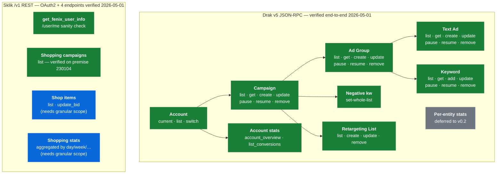

# Sklik MCP

[](https://pypi.org/project/sklik-mcp/)
[](https://github.com/larsdittinger/seznam-ads-mcp/actions)
[](LICENSE)

> **MCP server pro Seznam Sklik.** Spravujte kampaně, sestavy, klíčová slova a výkon přes Claude (nebo jakéhokoliv MCP klienta).
>
> **MCP server for Seznam Sklik advertising.** Manage campaigns, ad groups, keywords, and performance from Claude (or any MCP client) in natural language.

## Co to umí / What it does

- **Kampaně** — list, create, update, pause, resume, remove
- **Sestavy + inzeráty + klíčová slova** — full CRUD
- **Vylučující slova** — campaign + group scope
- **Statistiky** — flexible reporting (hourly/daily/weekly/monthly)
- **Retargeting + konverze**
- **Seznam Nákupy (Fénix)** — product groups + shopping stats
- **Multi-account** — switch between client accounts (převtělení)

## Quick start

### 1. Get a Sklik API token

In Sklik web admin: **Nastavení → API token**. You must be logged in as the account owner (not impersonated). For production access, email **sklik@firma.seznam.cz** to enable API.

### 2. Install

```bash
# With uv (recommended)
uvx sklik-mcp

# Or globally
uv tool install sklik-mcp

# From source
git clone https://github.com/larsdittinger/seznam-ads-mcp
cd seznam-ads-mcp
uv sync
uv run sklik-mcp
```

### 3. Configure your MCP client

#### Claude Desktop / Claude Code

Add to your config (`~/.config/Claude/claude_desktop_config.json` on Linux, similar on macOS/Windows):

```json
{
  "mcpServers": {
    "sklik": {
      "command": "uvx",
      "args": ["sklik-mcp"],
      "env": {
        "SKLIK_API_TOKEN": "your-drak-token-here",
        "SKLIK_FENIX_TOKEN": "your-v1-refresh-token-here"
      }
    }
  }
}
```

#### Cursor / other MCP clients

See the client's docs — it's a standard stdio MCP server invoked as `sklik-mcp` with `SKLIK_API_TOKEN` in the environment.

## Příklady / Examples

Once installed, ask Claude:

- *"Ukaž mi všechny aktivní kampaně se spendem za posledních 7 dní"*
- *"Najdi sestavy s CTR pod 1 % a spendem nad 1000 Kč"*
- *"Pozastav kampaň ID 12345"*
- *"Přidej vylučující slova `zdarma`, `levně` do kampaně 12345"*
- *"Porovnej výkon kampaní k1 a k2 za duben po týdnech"*

## Configuration

| Env var | Default | Purpose |
|---|---|---|
| `SKLIK_API_TOKEN` | — (required) | Drak JSON-RPC API token (campaigns, ads, keywords, …) |
| `SKLIK_FENIX_TOKEN` | — (optional) | Refresh JWT for the unified `/v1/` API (Sklik Nákupy / Fénix). When unset, the Fénix tools are not registered. |
| `SKLIK_ENDPOINT` | `https://api.sklik.cz/drak/json/v5` | Drak JSON endpoint |
| `SKLIK_FENIX_ENDPOINT` | `https://api.sklik.cz/v1` | Sklik /v1 endpoint |
| `SKLIK_REQUEST_TIMEOUT_S` | `30` | HTTP timeout |
| `SKLIK_LOG_LEVEL` | `INFO` | Python log level |

**Drak token:** Sklik web admin → Nastavení → API token (must be the account owner, not impersonated).

**Fénix refresh token:** Log in to https://www.sklik.cz/, generate a refresh token from the API section. The MCP exchanges it for a short-lived access token automatically and re-exchanges before expiry.

## Tools

See [docs/tools.md](docs/tools.md) for the full tool catalogue.

## Development

```bash
git clone https://github.com/larsdittinger/seznam-ads-mcp
cd seznam-ads-mcp
uv sync --extra dev
uv run pytest
uv run ruff check .
uv run mypy
```

## Status

**Alpha (v0.1.0)** — 44 tools, end-to-end verified against the live Sklik API on **2026-05-01**.

End-to-end test on a real account: created a fulltext campaign with ad
group, text ad, three keywords, and a retargeting list; paused/resumed
each; set negative keywords; removed everything; account ended where it
started.

### Coverage at a glance

| Surface | Tools | Status |
|---|---:|---|
| Accounts (`current_account`, `list_managed_accounts`, `switch_account`) | 3 | ✅ verified |
| Campaigns — list/get/create/update/pause/resume/remove | 7 | ✅ verified |
| Ad groups — list/get/create/update/pause/resume/remove | 7 | ✅ verified |
| Text ads — list/get/create/update/pause/resume/remove | 7 | ✅ verified (Drak v5 has a single `ads.create` shape — there's no DSA / dynamic-ad endpoint at all) |
| Keywords — list/get/add/update/pause/resume/remove | 7 | ✅ verified |
| Negative keywords — `set_campaign_negative_keywords` | 1 | ✅ verified |
| Retargeting lists — list/create/update/remove | 4 | ✅ verified |
| Conversions — `list_conversions` | 1 | ✅ verified |
| Account-level stats — `get_account_overview` | 1 | ✅ verified |
| Per-entity stats — `get_conversion_stats` etc. | 1 | ⏳ deferred to v0.2 (async report API) |
| Fénix /v1 — `get_fenix_user_info`, `list_shopping_campaigns` | 2 | ✅ verified (OAuth2 refresh→access flow + `/user/me` + `/nakupy/campaigns/` round-trip on 2026-05-01 against premise 230104) |
| Fénix /v1 — `list_shop_items`, `update_shop_item_bid`, `get_shopping_stats` | 3 | 🔵 wired, server returns 403 on read-only test token (insufficient resource scope, see Status notes) |

### Tool surface



Legend: 🟢 verified live · 🟡 unverified · ⚪ deferred to v0.2 · 🔵 wired against published OpenAPI spec

### Known limitations in v0.1.0

- **Per-entity stats** (campaigns/groups/ads/keywords) and **`get_conversion_stats`** — Drak v5 exposes `<entity>.createReport` → `<entity>.readReport`, and we've verified the wire shape end-to-end on 2026-05-01. **But every readReport against the test account returned `report: []`** (even on the active Nákupy:ethia.cz campaign over a 6-month window with a 60s wait). The Sklik web UI no longer uses Drak v5 reports — it has migrated to `https://www.sklik.cz/api/v1/campaigns?from=&to=` and a v4 GraphQL endpoint — so the Drak v5 report engine is likely deprecated or silently filtering. Shipping tools that always return zero data would be a footgun, so per-entity stats stay deferred to v0.2 until we have a known-good account or fresh Sklik guidance. Tracked as Task #14; full wire-shape findings in `docs/tools.md`.
- **Dynamic search ads (DSA)** — Drak v5 has no public dynamic-ad endpoint. We probed `ads.createDynamic`, `dynamicAds.create`, `dsa.create`, `groups.createDynamic` (all 404) and `ads.create`/`groups.update` reject every DSA-shaped field. Sklik's web UI uses a non-public route for DSA; until that surfaces in v5 (or a successor API), the MCP only exposes `create_text_ad`.
- **Fénix (Seznam Nákupy)** — OAuth2 refresh→access exchange, `/user/me`, `/nakupy/feeds/` and `/nakupy/campaigns/` all verified live against a real premise on 2026-05-01. `list_shop_items`, `get_shopping_stats` and `update_shop_item_bid` returned **403 Forbidden** on our test refresh token even though the token's `scope` covered `r rw rwa`; Sklik gates `/nakupy/shop-items/`, `/nakupy/products/`, `/nakupy/categories/` and `/nakupy/statistics/aggregated` behind a granular *resource* scope that has to be granted at the time the refresh token is generated. Implementation matches the OpenAPI spec exactly — when a token with the right scope is supplied, these tools should "just work". There is no list-premises endpoint in `/v1/`, so users must obtain their `premise_id` from the Sklik Nákupy admin UI.

See [docs/tools.md](docs/tools.md) for the full per-tool verification matrix.

## License

MIT — see [LICENSE](LICENSE).

## Acknowledgements

Built for the Czech PPC community. Inspired by [Pipeboard's Meta Ads MCP](https://github.com/pipeboard-co/meta-ads-mcp). Thanks to the Sklik team for the API.
